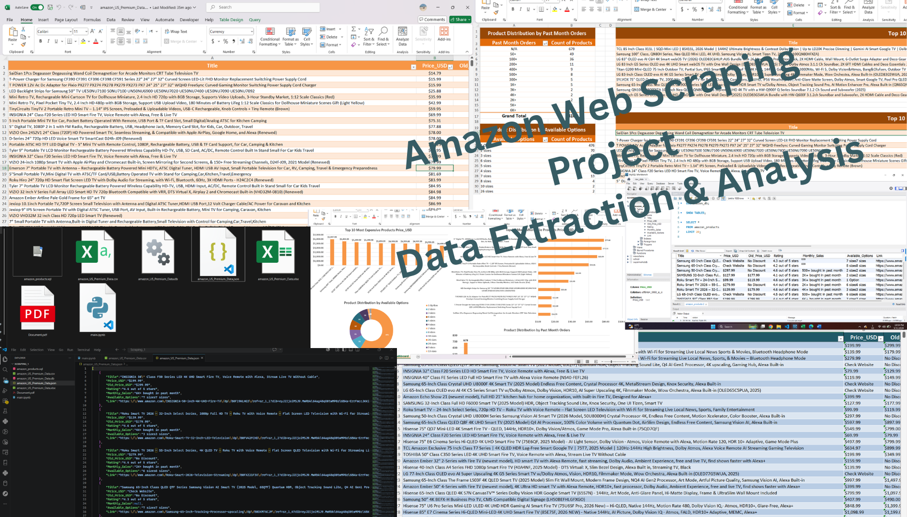
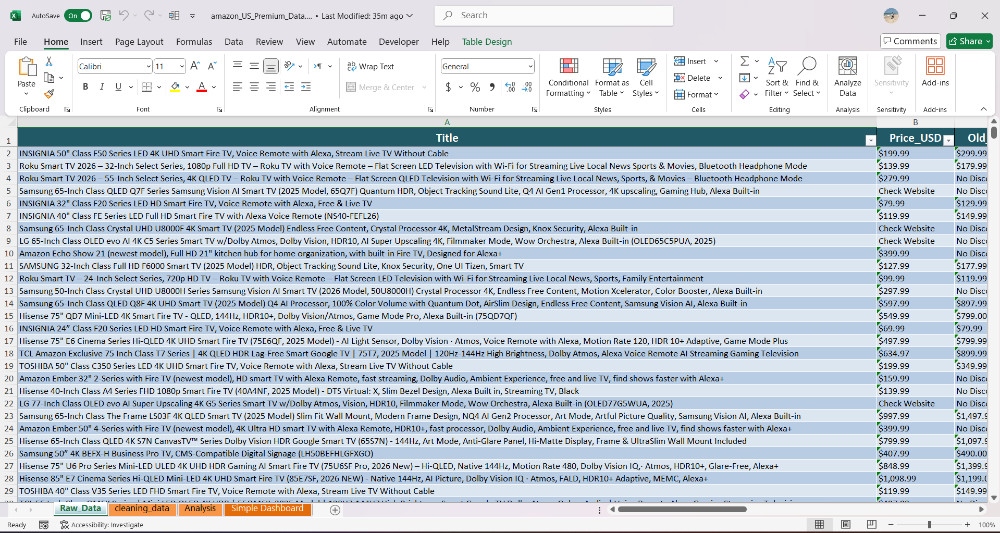
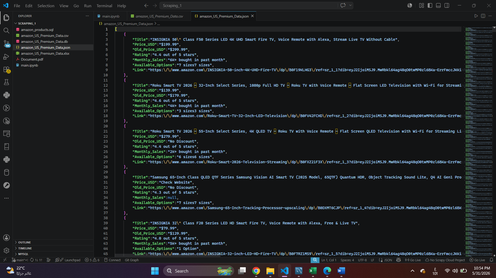
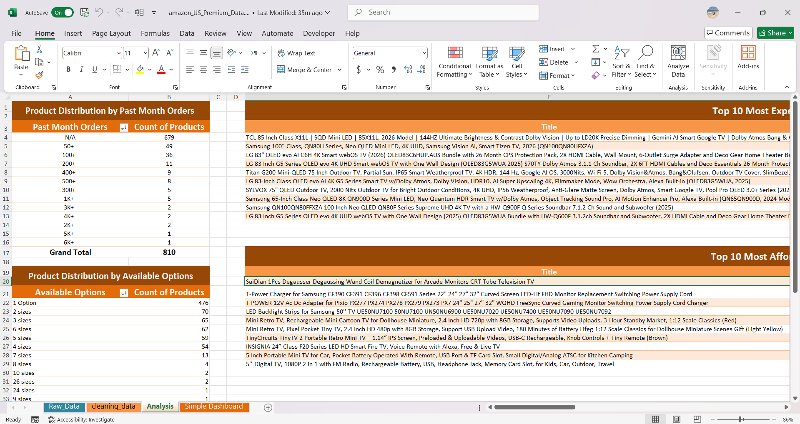
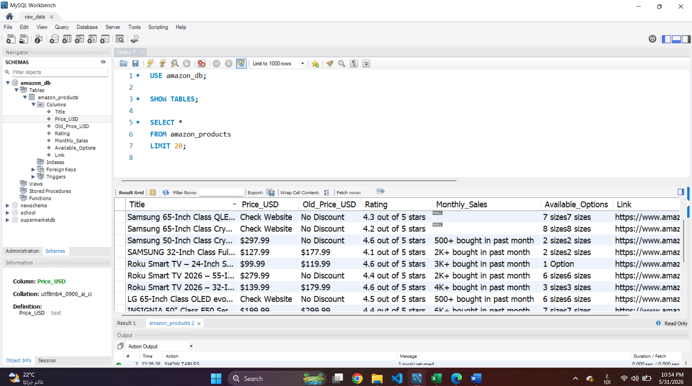
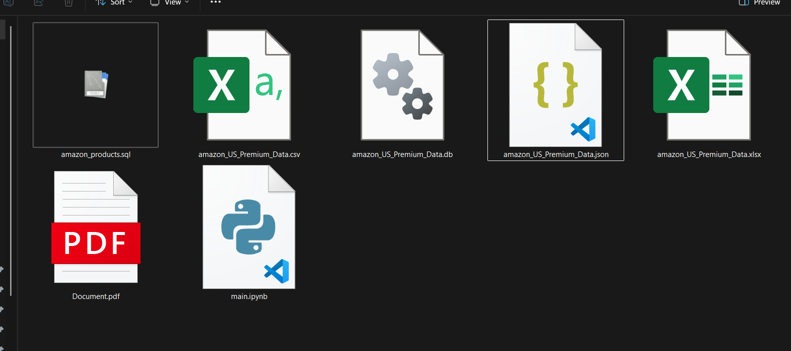
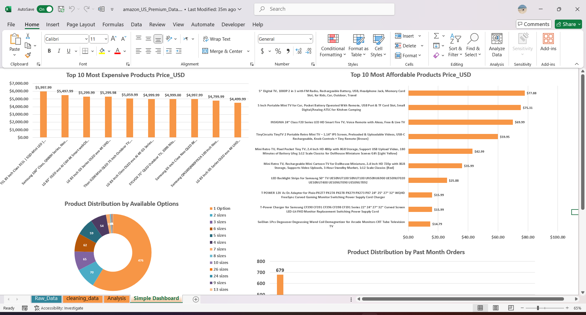
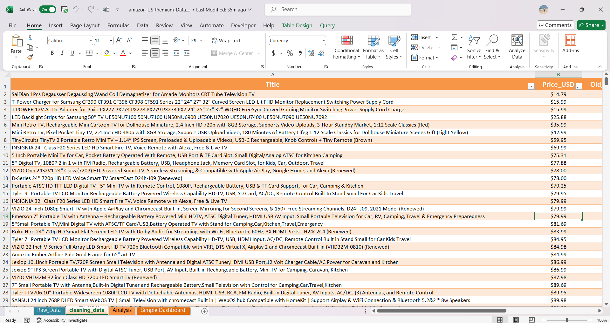

# Amazon TV Products Web Scraping & Data Engineering Project

## 📌 Project Overview

This repository showcases a complete, end-to-end data engineering pipeline designed to automate the extraction, cleaning, and multi-format storage of television product data from Amazon. Focusing on the Electronics (Televisions) category, the pipeline successfully handles anti-scraping challenges to extract and structure comprehensive data for **810+ products**.

---

## 🛠️ Tech Stack & Tools

- **Language:** Python
- **Web Scraping:** BeautifulSoup / Selenium
- **Data Processing:** Pandas (Data Cleaning, Normalization, & Transformation)
- **Databases:** MySQL, SQLite
- **Output Formats:** Excel (.xlsx), CSV (.csv), JSON (.json), SQLite (.db), MySQL (.sql)

---

## 🚀 Data Pipeline & Workflow (Step-by-Step)

### 1️⃣ Data Extraction (Web Scraping)

Automated web scraping scripts leveraging BeautifulSoup and Selenium to navigate Amazon's product listings, handle pagination, and bypass dynamic loading or anti-scraping blocks.
*The raw data is captured directly from the live listings.*

### 2️⃣ Data Cleansing & Processing

Utilized Pandas inside Jupyter Notebook to sanitize raw text, parse prices, clean ratings/review counts, handle missing values, and ensure strict data integrity.

### 3️⃣ Relational Database Design

Designed structured entity schemas to shift the flat scraped data into robust relational database models.

* **Database Schema Mapping:**
  
* **Local Database Instance (SQLite):**
  

### 4️⃣ Multi-Format Data Deployment

The final architecture safely exports and deploys the structured datasets into 5 distinct formats to fit any analysis or production environment.

### 5️⃣ Data Visualizations & Insights

Created custom visual dashboards and charts to analyze pricing trends, brand distributions, and product ratings across the 810+ extracted items.

---

## 📁 Repository Structure

As shown in the project setup, the repository follows a clean and professional architecture:

├── 📁 Data/                # Cleaned datasets exported in CSV, Excel, and JSON formats.
├── 📁 Databases/           # Relational database storage files (MySQL .sql script & SQLite .db file).
├── 📁 Notebook/            # Core Jupyter Notebook containing the web scraping and Pandas pipeline.
├── 📁 Dashboard/           # Contains all project visuals and documentation images (1.png to 8.png).
├── 📄 Document.pdf         # Detailed project report and official documentation.
└── 📄 README.md            # Project overview and guide (this file).

---

## 📊 Skills Demonstrated

- Web Scraping & Automation
- Data Cleaning, Transformation & ETL
- Relational Database Design & SQL Scripting
- Multi-format Data Deployment
- Clean Architecture & Project Organization
